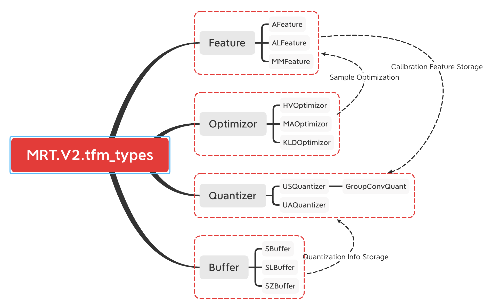

V2 Documentation
================

[TOC]

V2 Architecture
~~~~~~~~~~~~~~~

MRT V2 is superset of MRT that supports enriching features like zero
point quantization, channel-slice and groupwise quantization for
convolution. The core implementation attributes to the module
``tfm_types.py``, the architecture of which display like this:

-  |avatar|

Quantizer
~~~~~~~~~

+---+------------------+-----------------+-----------------+-----------------+
|   | Parameter        | Input (Uniform  | Parameter       | Input (Uniform  |
|   | (Uniform         | Symmetric       | (Uniform Affine | Affine          |
|   | Symmetric        | Quantizer)      | Quantizer)      | Quantizer)      |
|   | Quantizer)       |                 |                 |                 |
+===+==================+=================+=================+=================+
| S | :math:`sc_       | :math:`sc_      | :math:`sc_      | :math:`sc_      |
| c | {w} = \frac{2^{  | {x} = \frac{2^{ | {w} = \frac{2^{ | {x} = \frac{2^{ |
| a | PREC-1}-         | PREC-1}-        | PREC}-1}{\max{W | PREC}-1}{\max{  |
| l | 1}{\max{|Wr|}}`  | 1}{\max{|Xr|}}` | r} - \min{Wr}}` | Xr}-\min {Xr}}` |
| e |                  |                 |                 |                 |
+---+------------------+-----------------+-----------------+-----------------+
| Z | -                | -               | :math:`zp_      | :math:`zp_      |
| e |                  |                 | {wr} = \min Wr` | {xe} = \text{   |
| r |                  |                 |                 | round}\Big(\min |
| o |                  |                 |                 | Xr \cdot sc_{xe |
| P |                  |                 |                 | }\Big) \\       |
| o |                  |                 |                 | rzp_{x} =       |
| i |                  |                 |                 | round \Big      |
| n |                  |                 |                 | (\min Xr \Big)` |
| t |                  |                 |                 |                 |
+---+------------------+-----------------+-----------------+-----------------+
| Q | :math:`Wq        | :math:`         | :mat            | :math:`frac,    |
| u | = \text{round}   | frac, exp = \te | h:`W_{q} = \tex | exp = \text{cvm |
| a | \Big(sc_{w}      | xt{cvm_float}\b | t{round} \Big[  | _float}\bigg(\f |
| n | \cdot            | igg(\frac{sc_{x | (sc_{w} \left(  | rac{sc_{x}}{sc_ |
| t | Wr \Big)`        | }}{sc_{xe}}\big | W_{r} - zp_{wr} | {xe}}\bigg) \\  |
| i |                  | g) \\ Xq = \tex |  \right) \Big]` | Xq = \text{real |
| z |                  | t{realize} (X_{ |                 | ize}(Xe - zp_{x |
| a |                  | e}, frac, exp)` |                 | e}, frac, exp)` |
| t |                  |                 |                 |                 |
| i |                  |                 |                 |                 |
| o |                  |                 |                 |                 |
| n |                  |                 |                 |                 |
+---+------------------+-----------------+-----------------+-----------------+
| R | :math:`Wr        | :math:`Xr =     | :math:`Wr       | :math:`Xr       |
| e | = \frac{Wq       | \frac{Xq        | = \frac{Wq}{sc_ | = \frac{Xq}{sc_ |
| q | }{sc_{w}}`       | }{sc_{x}}`      | {w}} + zp_{wr}` | {x}} + rzp_{x}` |
| u |                  |                 |                 |                 |
| a |                  |                 |                 |                 |
| n |                  |                 |                 |                 |
| t |                  |                 |                 |                 |
| i |                  |                 |                 |                 |
| z |                  |                 |                 |                 |
| a |                  |                 |                 |                 |
| t |                  |                 |                 |                 |
| i |                  |                 |                 |                 |
| o |                  |                 |                 |                 |
| n |                  |                 |                 |                 |
+---+------------------+-----------------+-----------------+-----------------+

The variable whose names ending up with ‘**q**’ stand for int quantized
operators, ‘**r**’ stand for floating point operators and ‘**e**’ stand
for int expanded operators.

Re-quantization into expansion is elaborated in operator expansion, see
`NN Operator Expansion <#nn-operator-expansion>`__, `Broadcast Operator
Expansion <#broadcast-operator-expansiono>`__, `Elemwise Operator
Expansion <#elemwise-operator-expansion>`__, `Transform Operator
Expansion <#transform-operator-expansion>`__.

Granularity
~~~~~~~~~~~

MRT Support both layer-wise and channel-wise quantization. Channel wise
quantization is implemented by graph-level channel split and channel
merge.

Channel Split
^^^^^^^^^^^^^

To compromise between precision and calculation operations, MRT support
quantization with respect to channel features. Use ``slice`` to split
the channels in MRT rewrite process:

.. math::

   \forall i \text{ in } [0, C, \text{step})

.. math::

   Xi = \text{slice}\Big(X, \\
   \text{begin=(None,)*ichannel+(i,)+(None,)*(ndims-ichannel-1)}, \\
   \text{end=(None,)*ichannel+(i+step,)+(None,)*(ndims-ichannel-1)}, \\
   \text{step=(-1,)*ichannel+(step,)+(-1,)*(ndims-ichannel-1)}\Big)

If :math:`X` is of channel feature and :math:`W` is of layer feature or
vice versa, :math:`W` (or :math:`X`) will also be split to be compatible
with :math:`X` (or :math:`W`).

Take ``Convolution`` (for simplicity, only point-wise convolution is
considered here, i.e. ``num_group=1``) for instance (only uniform
symmetric quantization is considered for simplicity), layer-wise
Convolution can be rewritten as: $$ :raw-latex:`\begin{align}

Ye[n,o,p,q] 

&= \sum_{i=0}^{C-1} \sum_{ki=0}^{KH-1} \sum_{kj=0}^{KW-1} Xq[n, i, p \cdot SH + ki \cdot DH, q \cdot SW + kj \cdot DW] \cdot Wq[o,i,ki,kj] \\

&= \sum_{i=0}^{C/step-1} \sum_{j=i*step}^{(i+1)*step-1} \sum_{ki=0}^{KH-1} \sum_{kj=0}^{KW-1} Xq[n, j, p \cdot SH + ki \cdot DH, q \cdot SW + kj \cdot DW] \cdot Wq[o,j,ki,kj] \\

&= \sum_{i=0}^{C/step-1} Convolution(Xq[:,i*step:(i+1)*step,:,:], Wq[:,i*step:(i+1)*step,:,:]) \\

&= \sum_{i=0}^{C/step-1} Yei[n,o,p,q]

\end{align}` $$

Channel Merge
^^^^^^^^^^^^^

Merge the channel symbol components to the equivalent symbol.

For operators like ``pad``, ``relu``, ``Pooling``, merge as follows:

.. math::

   X = \text{concat}\Big( \big[Xi, \forall i \in [0, C) \big], \text{dim=ich} \Big)
   \tag{concat}

For operators like ``Convolution`` (``num_group=1``), merge as follows:

.. math::

   X = \sum_{i=0}^{C-1} Xi
   \tag{add_n}

For operators like ``Convolution`` (``num_group>1``), the slice channel
process will be performed in each the output channel, and **concat**
along the output channel axis.

NN Operator Expansion
~~~~~~~~~~~~~~~~~~~~~

Convolution
^^^^^^^^^^^

**Limitations**

1. Only 2-D case is considered
2. ``num_group`` is asserted to be 1
3. ``bias`` is fused in MRT rewrite

**Inputs**

1. Input data :math:`X`, of shape :math:`(N,C,H,W)`

2. Kernel weight :math:`W`, of shape :math:`(O,C,KH,KW)`

**Attributes**

1. :math:`\text{padding} = (PH,PW)`

2. :math:`\text{stride} = (SH,SW)`

3. :math:`\text{dilation} = (DH,DW)`

**Real Formalization**

.. math::

   \forall n \in [0, N), \quad
   \forall o \in [0, O), \quad
   \forall p \in \Bigg{[} 0, \bigg\lfloor \frac{H - DH \cdot (KH-1) - 1}{SH} \bigg\rfloor + 1 \Bigg{)}, \quad
   \forall q \in \Bigg{[} 0, \bigg\lfloor \frac{W - DW \cdot (KW-1) - 1}{SW} \bigg\rfloor + 1 \Bigg{)}

.. math::

   Yr[n,o,p,q] = \sum_{i=0}^{C-1} \sum_{ki=0}^{KH-1} \sum_{kj=0}^{KW-1} Xr[n, i, p \cdot SH + ki \cdot DH, q \cdot SW + kj \cdot DW] \cdot Wr[o,i,ki,kj]

Note, if ``num_groups`` is not 1, then convolution is generalized as
**Groupwise Convolution**.

Specifically, suppose kernel weight :math:`W` is of shape
:math:`(O,IC,KH,KW)` and input data :math:`X` is of shape
:math:`(N,C,H,W)`. $$ Yr[n,o,p,q]

= :raw-latex:`\sum`\ *{i=0}^{IC-1} :raw-latex:`\sum`*\ {ki=0}^{KH-1}
:raw-latex:`\sum`\_{kj=0}^{KW-1}
Xr:raw-latex:`\Bigg[n, \bigg\lfloor\frac{o}{OPG}\bigg\rfloor IC + i, p \cdot SH + ki \cdot DH, q \cdot SW + kj \cdot DW\Bigg] `:raw-latex:`\cdot `Wr[o,i,ki,kj]
$$ For simplicity, here we will not inlcude the notation of groupwise
convolution.

Given :math:`Xe` and :math:`We`, MRT respectively quantize them into
:math:`Xq` and :math:`Wq`.

**Expansion Formalization 1: Symmetric Quantized X and W**

.. math::

   Ye[n,o,p,q] = \sum_{i=0}^{C-1} \sum_{ki=0}^{KH-1} \sum_{kj=0}^{KW-1} Xq[n, i, p \cdot SH + ki \cdot DH, q \cdot SW + kj \cdot DW] \cdot Wq[o,i,ki,kj]

where the scale of :math:`Ye` is :math:`sc_{x} \ sc_{w}`.

**Expansion Formalization 2: Zero Point Quantized X and Symmetric
Quantized W**

.. math::

   Ye1[n,o,p,q] = 
   \sum_{i=0}^{C-1} \sum_{ki=0}^{KH-1} \sum_{kj=0}^{KW-1} Xq[n, i, p \cdot SH + ki \cdot DH, q \cdot SW + kj \cdot DW] \cdot Wq[o,i,ki,kj]

.. math::

   Ye2[n,o,p,q] = zp_{xe} \sum_{i=0}^{C-1} \sum_{ki=0}^{KH-1} \sum_{kj=0}^{KW-1} Wq[o,i,ki,kj]

where the scale of :math:`Ye1` is :math:`sc_{x} \ sc_{w}` and the scale
of :math:`Ye2` is :math:`sc_{w}`. By
`quantize_scale <#quantize-scale>`__, MRT respectively quantize them
into :math:`Yq1` and :math:`Yq2`. Then get the final expansion.

.. math::

   Ye = Yq1 + Yq2

**Expansion Formalization 3: Symmetric Quantized X and Zero Point
Quantized W**

.. math::

   Ye1[n,o,p,q] =  
   \sum_{i=0}^{C-1} \sum_{ki=0}^{KH-1} \sum_{kj=0}^{KW-1} Xq[n, i, p \cdot SH + ki \cdot DH, q \cdot SW + kj \cdot DW] \cdot Wq[o,i,ki,kj]

.. math::

   Ye2[n,o,p,q] =  
   zp_{we} \sum_{i=0}^{C-1} \sum_{ki=0}^{KH-1} \sum_{kj=0}^{KW-1} Xq[n, i, p \cdot SH + ki \cdot DH, q \cdot SW + kj \cdot DW]

where the scale of :math:`Ye1` is :math:`sc_{x} \ sc_{w}` and the scale
of :math:`Ye2` is :math:`sc_{x}`. By
`quantize_scale <#quantize-scale>`__, MRT respectively quantize them
into :math:`Yq1` and :math:`Yq2`. Then get the final expansion.

.. math::

   Ye = Yq1 + Yq2

**Expansion Formalization 4: Zero Point Quantized X and W (Deprecated)**

.. math::

   \begin{equation} \begin{split}
   Ye[n,o,p,q]
   = \sum_{i=0}^{C-1} \sum_{ki=0}^{KH-1} \sum_{kj=0}^{KW-1} Xq[n, i, p \cdot SH + ki \cdot DH, q \cdot SW + kj \cdot DW] \cdot Wq[o,i,ki,kj] \\
   + w_{zp} \sum_{i=0}^{C-1} \sum_{ki=0}^{KH-1} \sum_{kj=0}^{KW-1} Xq[n, i, p \cdot SH + ki \cdot DH, q \cdot SW + kj \cdot DW] \\
   + x_{zp} \sum_{i=0}^{C-1} \sum_{ki=0}^{KH-1} \sum_{kj=0}^{KW-1} Wq[o,i,ki,kj]
   + C \cdot KH \cdot KW \cdot x_{zp} \cdot w_{zp}
   \end{split} \end{equation}

.. code:: python

   Ye = Convoltion(Xq, Wq, **attrs) + wzp * Convoltion(Xq, W1, **attrs) + C2 + C3
   infer_prec1 = get_bit_cnt(C*KH*KW) + xprec + wprec + 2
   infer_prec2 = get_bit_cnt(abs(wzp)*C*KH*KW) + xprec + 1
   infer_prec3 = get_bit_cnt(abs(xzp)*C*KH*KW) + wprec + 1
   infer_prec4 = get_bit_cnt(abs(wzp)*abs(xzp)*C*KH*KW)
   infer_prec = max(infer_prec1, infer_prec2, infer_prec3, infer_prec4) + 2

pad
^^^

**Limitations**

1. Only support ``constant`` mode
2. :math:`\text{constant_value} = 0`
3. Only support pad of :math:`H` dimension and :math:`W` dimension

**Inputs**

1. Input data :math:`X`, of shape :math:`(N,C,H,W)`

**Attributes**

1. :math:`\text{pad_width} = (0,0,0,0,PH_1,PH_2,PW_1,PW_2)`

**Real Formalization**

.. math::

   \forall n \in [0, N), \quad
   \forall c \in [0, C), \quad
   \forall h \in [0, PH_1 + H + PH_2), \quad
   \forall w \in [0, PW_1 + W + PW_2)

.. math::

   \begin{equation}
     Yr[n,c,h,w] =
       \begin{cases}
         Xr[n, c, h-PH_1, w-PW_1] & PH_1 \leq h<H+PH_1 \wedge PW_1 \leq w < W+PW_1 \\
         0 & \text{otherwise}
       \end{cases}       
   \end{equation}

**Expansion Scale**

.. math::

   sc_{ye} = sc_{xe}

**Expansion Formalization**

.. math::

   \begin{equation} \begin{split}
     Ye[n,c,h,w] =
       \begin{cases}
         Xe[n, c, h-PH_1, w-PW_1] & PH_1 \leq h<H+PH_1 \wedge PW_1 \leq w < W+PW_1 \\
         0 & \text{otherwise}
       \end{cases}       
   \end{split} \end{equation}

.. code:: python

   Ye = pad(Xe, **attrs)

relu
^^^^

**Inputs**

1. Input data :math:`X`, of shape :math:`(M_0,M_1,...,M_{N-1})`

**Real Formalization**

.. math::

   \forall i \in [0, N), \quad \forall m_i \in [0, M_i)

.. math::

   Yr[m_0,m_1,...,m_{N-1}] = \max{\big( 0, Xr[m_0,m_1,...,m_{N-1}] \big)}

**Expansion Scale**

.. math::

   sc_{ye} = sc_{xe}

**Expansion Formalization**

.. math::

   Ye[m_0,m_1,...,m_{N-1}] = \max{\big(0, Xe[m_0,m_1,...,m_{N-1}]\big)}

.. code:: python

   Ye = relu(Xe)

Pooling
^^^^^^^

**Limitations**

1. Only 2-D case is considered
2. ``avg`` pooling will be rewritten into ``Convolution`` or
   ``broadcast_mul``
3. Only ``max`` pooling will be considered

**Inputs**

1. Input data :math:`X`, of shape :math:`(N,C,H,W)`

**Attributes**

1. :math:`\text{stride} = (SH,SW)`

2. :math:`\text{kernel} = (KH, KW)`

3. :math:`\text{padding} = (PH, PW)`

**Real Formalization**

.. math::

   \forall n \in [0, N), \quad
   \forall c \in [0, C), \quad
   \forall p \in \Bigg{[} 0, \bigg\lfloor \frac{H - KH}{SH} \bigg\rfloor + 1 \Bigg{)}, \quad
   \forall q \in \Bigg{[} 0, \bigg\lfloor \frac{W - KW}{SW} \bigg\rfloor + 1 \Bigg{)}

.. math::

   Yr[n,c,p,q] = \max_{p \cdot SH \leq p' < p \cdot SH + KH \\
   q \cdot SW \leq q' < q \cdot SW + KW} 
   Xr[n,c,p',q']

**Padding beforehand**

.. code:: python

   Xe = pad(Xe, mode="constant", pad_width=(0,0,0,0,PH,PH,PW,PW), constant_value=INT_MIN)

**Expansion Scale**

.. math::

   sc_{ye} = sc_{xe}

**Expansion Formalization**

.. math::

   Ye[n,c,p,q] = \max_{p' \in [p \cdot SH, p \cdot SH + KH) \\
   q' \in [q \cdot SW, q \cdot SW + KW)} 
   Xe[n,c,p',q']

.. code:: python

   Ye = Pooling(Xe, stride=stride, kernel=kernel)

FullyConnected
^^^^^^^^^^^^^^

**Limitations**

1. The input only supports layer-wise quantization
2. ``bias`` is fused in MRT rewrite

**Input**

1. Input data :math:`X`, of shape :math:`(N,K)`
2. Weight :math:`W`, of shape :math:`(M, K)`

**Real Formalization**

.. math::

   \forall m \in [0, M), \quad
   \forall n \in [0, N)

.. math::

   Yr[n,m] = \sum_{i=0}^{K-1} X[n,i] \cdot W[m,i]

**Expansion Scale**

.. math::

   sc_{ye} = sc_{x} \cdot sc_{w}

**Expansion Formalization 1: Symmetric Quantized X and W**

.. math::

   Ye[n,m] = \sum_{i=0}^{K-1} Xq[n,i] \cdot Wq[m,i]

.. code:: python

   Ye = FullyConnected(Xq, Wq)
   infer_prec = get_bit_cnt(K) + xprec + wprec

**Expansion Formalization 2: Zero Point Quantized X​ and Symmetric
Quantized W**

.. math::

   Ye[n,m] = \sum_{i=0}^{K-1} Xq[n,i] \cdot Wq[m,i] 
   + zp_x \sum_{i=0}^{K-1} Wq[m,i]

.. code:: python

   Ye = FullyConnected(Xq, Wq) + C
   infer_prec1 = get_bit_cnt(K) + xprec + wprec + 1
   infer_prec2 = get_bit_cnt(abs(C))
   infer_prec = max(infer_prec1, infer_prec2) + 1

**Expansion Formalization 3: Symmetric Quantized X​ and Zero Point
Quantized W**

.. math::

   Ye[n,m] = \sum_{i=0}^{K-1} Xq[n,i] \cdot Wq[m,i] +
   zp_{w} \sum_{i=0}^{K-1} Xq[n,i]

.. code:: python

   Ye = FullyConnected(Xq, Wq) + C * sum(Xq, axis=1, keep_dims=True)
   infer_prec1 = get_bit_cnt(K) + xprec + wprec + 1
   infer_prec2 = get_bit_cnt(abs(C)*K) + xprec
   infer_prec = max(infer_prec1, infer_prec2) + 1

**Expansion Formalization 4: Zero Point Quantized X​ and W**

.. math::

   Ye[n,m] = \sum_{i=0}^{K-1} Xq[n,i] \cdot Wq[m,i]
   + zp_{w} \sum_{i=0}^{K-1} Xq[n,i]
   + zp_{x} \sum_{i=0}^{K-1} Wq[m,i]
   + zp_{w} \cdot zp_{x} \cdot K

.. code:: python

   Ye = FullyConnected(Xq, Wq) + C1 * sum(Xq, axis=1, keep_dims=True) + C2 + C3
   infer_prec1 = get_bit_cnt(K) + xprec + wprec + 2
   infer_prec2 = get_bit_cnt(abs(C1)*K) + xprec + 1
   infer_prec3 = get_bit_cnt(abs(max(C2)))
   infer_prec4 = get_bit_cnt(abs(C3))
   infer_prec = max(infer_prec1, infer_prec2, infer_prec3, infer_prec4) + 2

Broadcast Operator Expansion
~~~~~~~~~~~~~~~~~~~~~~~~~~~~

broadcast_add
^^^^^^^^^^^^^

use `Quantize Scale <#quantize-scale>`__.

Elemwise Operator Expansion
~~~~~~~~~~~~~~~~~~~~~~~~~~~

elemwise_add
^^^^^^^^^^^^

use `Quantize Scale <#quantize-scale>`__.

add_n
^^^^^

use `Quantize Scale <#quantize-scale>`__.

Transform Operator Expansion
~~~~~~~~~~~~~~~~~~~~~~~~~~~~

concat
^^^^^^

use `Quantize Scale <#quantize-scale>`__.

flatten
^^^^^^^

**Inputs**

1. Input data :math:`X`, of shape :math:`(M_0,M_1,...,M_{N-1})`

**Real Formalization**

.. math::

   \forall i \in [0, N), \quad \forall m_i \in [0, M_i)

.. math::

   Yr\Bigg[\sum_{j=0}^{N-2} m_j \prod_{i=j+1}^{N-1}M_i + m_{N-1}\Bigg] = Xr[m_0,m_1,...,m_{N-1}]

**Expansion Scale**

.. math::

   sc_{ye} = sc_{xe}

**Expansion Formalization**

.. math::

   Ye\Bigg[\sum_{j=0}^{N-2} m_j \prod_{i=j+1}^{N-1}M_i + m_{N-1}\Bigg] = Xe[m_0,m_1,...,m_{N-1}]

.. code:: python

   Ye = flatten(Xe)

Generalized Expansion Function
~~~~~~~~~~~~~~~~~~~~~~~~~~~~~~

Quantize Scale
^^^^^^^^^^^^^^

**Limitations**

1. All the inputs only support symmetric quantize

**Expansion Scale**

.. math::

   sc_{ye} = sc_{xi}

**Expansion Formalization**

.. code:: python

   Ye = quantize_scale(**Xqs, **attrs)
   infer_prec = max(xprecs) if op_name == "Concat" else max(xprecs)+1

Op-level Configuration Turorial
~~~~~~~~~~~~~~~~~~~~~~~~~~~~~~~

Optimized Quantization
^^^^^^^^^^^^^^^^^^^^^^

MRT GEN support op-level **channel-slice** and **zero point
specification** to optimize the quantization process for a better int
inference result. Two steps are needed in the optimization process.

**Step 1. Find out potential layers to optimize**

A simple method is to print out the names of all the layers like
follows. See
`mrt.V2.Transformer.py <https://github.com/CortexFoundation/cvm-runtime/blob/archRev/python/mrt/V2/transformer.py>`__

.. code:: python

           print out zero point quantization candidates
           from mrt.sym_utils import is_params, sym_iter
           sym, params = self.current_model.symbol, self.current_model.params
           for s in topo_sort(sym):
               name, op_name = s.attr('name'), s.attr('op_name')
               if op_name in ["broadcast_add"]:
                   childs = sym_iter(s.get_children())
                   for c in childs:
                       cname = c.attr('name')
                       if is_params(c, params):
                           weight = params[cname]
                           maxv = weight.max().asscalar()
                           minv = weight.min().asscalar()
                           print(cname)
               elif op_name in ["Convolution"]:
                   childs = sym_iter(s.get_children())
                   for c in childs:
                       cname = c.attr('name')
                       if is_params(c, params):
                           weight = params[cname]
                           maxv = weight.max().asscalar()
                           minv = weight.min().asscalar()
                           print(maxv, minv, cname)
           exit()

**Step 2. Set up Cfg_groups in configuration file**

See `Configuration
Example <https://github.com/CortexFoundation/cvm-runtime/blob/archRev/python/mrt/gen/model_zoo/config.example.ini>`__.
An examplary configuration is provide.

.. code:: ini

   ...
   [CALIBRATION]
   # [Optional] Calibration batch size, 16 by default.
   Batch=16
   # [Optional] Iterator numbers of calibration, 1 by default.
   Calibrate_num=1
   # [Optional] Granularity, Quantizer and Optimizor Configuration for specified nodes 
   Cfg_groups=
     ["mrt_sym_separate_bias_alexnet0_conv0_fwd_0"]: gn_info: {"gn_type"; "channel-wise". "ichannel"; 1. "step"; 1},
     ["alexnet0_conv0_weight"]: quant_type: UniformAffine,
       ["mrt_sym_separate_bias_alexnet0_dense1_bias_0"]: quant_type: UniformAffine
   ...

Layer-wise Restoration
^^^^^^^^^^^^^^^^^^^^^^

Also, both MRT and MRT GEN support layer-wise **restoration** for
debugging purpose if MRT is developed for enhancement purposes. See
`Configuration
Example <https://github.com/CortexFoundation/cvm-runtime/blob/archRev/python/mrt/gen/model_zoo/config.example.ini>`__.
The restore can be specified by symbol names in ``Restore_name``:

.. code:: ini

   [QUANTIZATION]
   ...
   # [Optional] Debug usage
   Restore_name=
   ...

Model Test
~~~~~~~~~~

The comparison between the original float model, mrt quantized model and
non-tuned mrt gen quantized model is listed as below.

+-----------+-----------+-----------+-----------+--------------------+
| model     | Original  | MRT       | MRT       | MRT GEN Quanzied   |
| name      | Float     | Quantized | Quantized | Model              |
|           | Model     | Model     | Model     |                    |
|           |           | (Tuned)   |           |                    |
+===========+===========+===========+===========+====================+
| re        | top1      | top1      | top1      | top1               |
| snet50_v1 | =77.39%to | =76.47%to | =76.41%to | =75.66%top2=92.79% |
|           | p5=93.59% | p5=93.28% | p5=93.18% |                    |
+-----------+-----------+-----------+-----------+--------------------+
| re        | top1      | top1      | top1      | top1               |
| snet50_v2 | =77.15%to | =70.76%to | =69.89%to | =69.83%top5=88.84% |
|           | p5=93.44% | p5=89.56% | p5=88.84% |                    |
+-----------+-----------+-----------+-----------+--------------------+
| re        | top1      | top1      | top1      | top1               |
| snet18_v1 | =70.96%to | =70.11%to | =69.90%to | =69.97%top5=88.84% |
|           | p5=89.93% | p5=89.60% | p5=89.50% |                    |
+-----------+-----------+-----------+-----------+--------------------+
| resnet18  | top1      | -         | top1      | top1               |
| v1_b_0.89 | =67.21%to |           | =63.75%to | =69.97%top5=89.53% |
|           | p5=87.45% |           | p5=85.67% |                    |
+-----------+-----------+-----------+-----------+--------------------+
| quickdraw | top1      | -         | top1      | top1               |
|           | =81.90%to |           | =81.83%to | =81.89%top5=98.22% |
|           | p5=98.26% |           | p5=98.24% |                    |
+-----------+-----------+-----------+-----------+--------------------+
| qd10_re   | top1      | -         | top1      | top1               |
| snetv1_20 | =85.79%to |           | =85.79%to | =85.94%top5=98.73% |
|           | p5=98.73% |           | p5=98.73% |                    |
+-----------+-----------+-----------+-----------+--------------------+
| de        | top1      | -         | top1      | top1               |
| nsenet161 | =77.62%to |           | =77.32%to | =76.90%top5=93.49% |
|           | p5=93.82% |           | p5=93.63% |                    |
+-----------+-----------+-----------+-----------+--------------------+
| alexnet   | top1      | -         | top1      | top1=51.82%t       |
|           | =55.91%to |           | =51.69%to | op5=78.09%(channel |
|           | p5=78.75% |           | p5=77.99% | sliced)            |
+-----------+-----------+-----------+-----------+--------------------+
| cifar_re  | top1      | -         | top1      | top1               |
| snet20_v1 | =92.88%to |           | =92.82%to | =92.52%top5=99.79% |
|           | p5=99.78% |           | p5=99.75% |                    |
+-----------+-----------+-----------+-----------+--------------------+
| mob       | top1      | top1      | top1      | top1               |
| ilenet1_0 | =70.77%to | =66.11%to | =63.07%to | =61.30%top5=83.88% |
|           | p5=89.97% | p5=87.35% | p5=85.02% |                    |
+-----------+-----------+-----------+-----------+--------------------+
| mobile    | top1      | top1      | top1      | top1               |
| netv2_1.0 | =71.51%to | =69.39%to | =66.93%to | =62.15%top5=84.00% |
|           | p5=90.10% | p5=89.30% | p5=87.39% |                    |
+-----------+-----------+-----------+-----------+--------------------+
| shuf      | top1      | top1      | top1      | top1               |
| flenet_v1 | =63.48%to | =60.45%to | =60.40%to | =60.13%top5=82.70% |
|           | p5=85.12% | p5=82.95% | p5=82.91% |                    |
+-----------+-----------+-----------+-----------+--------------------+
| sque      | top1      | top1      | top1      | top1               |
| ezenet1.0 | =57.20%to | =55.16%to | =52.46%to | =54.36%top5=78.19% |
|           | p5=80.04% | p5=78.67% | p5=77.10% |                    |
+-----------+-----------+-----------+-----------+--------------------+
| tf_inc    | top1      | top1      | top1      | top1               |
| eption_v3 | =55.58%to | =55.54%to | =53.79%to | =52.13%top5=73.96% |
|           | p5=77.56% | p5=83.03% | p5=75.99% |                    |
+-----------+-----------+-----------+-----------+--------------------+
| vgg19     | top1      | top1      | top1      | top1               |
|           | =74.14%to | =73.75%to | =73.70%to | =73.58%top5=91.60% |
|           | p5=91.78% | p5=91.67% | p5=91.66% |                    |
+-----------+-----------+-----------+-----------+--------------------+
| mnist     | top1=     | -         | top1=     | top1=              |
|           | 99.18%top |           | 99.17%top | 98.16%top5=100.00% |
|           | 5=100.00% |           | 5=100.00% |                    |
+-----------+-----------+-----------+-----------+--------------------+
| trec      | 97.84%    | 97.63%    | 97.20%    | 97.38%             |
+-----------+-----------+-----------+-----------+--------------------+
| y         | 81.37%    | -         | 82.08%    | 80.85%             |
| olo3_dark |           |           |           |                    |
| net53_voc |           |           |           |                    |
+-----------+-----------+-----------+-----------+--------------------+
| yolo      | 75.98%    | -         | 71.53%    | 70.70%             |
| 3_mobilen |           |           |           |                    |
| et1.0_voc |           |           |           |                    |
+-----------+-----------+-----------+-----------+--------------------+
| ssd_5     | 80.27%    | -         | 80.01%    | 79.57%             |
| 12_resnet |           |           |           |                    |
| 50_v1_voc |           |           |           |                    |
+-----------+-----------+-----------+-----------+--------------------+
| ssd_51    | 75.57%    | 71.32%    | 70.21%    | 69.68%             |
| 2_mobilen |           |           |           |                    |
| et1.0_voc |           |           |           |                    |
+-----------+-----------+-----------+-----------+--------------------+
| tf        | top1      | -         | to        | top1=31.71         |
| _mobilene | =34.68%to |           | p1=3.39%t | %top5=55.83%(slice |
| t_v1_0.25 | p5=59.32% |           | op5=9.93% | channel)           |
| _224_lite |           |           |           |                    |
+-----------+-----------+-----------+-----------+--------------------+

The MRT GEN module apply pad separate for ``Convolution`` and bias
``separate`` for both ``Convolution`` and ``FullyConnected``. From the
chart above we can that some model like ``quickdraw``,
``qd10_resnetv1_20``, ``resnet18v1_b_0.89``, ``trec``, ``squeezenet1.0``
and ``alexnet`` and have observable better accuracy than MRT module.

