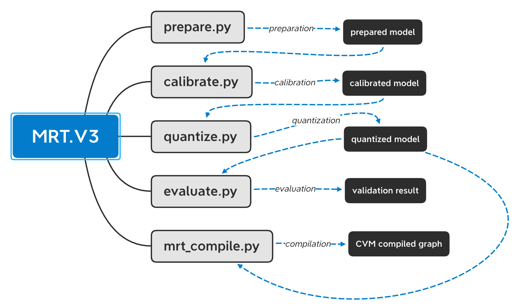

V3 Documentation
================

[TOC]

V3 Architecture
~~~~~~~~~~~~~~~

MRT V3 is the functional entry point of MRT taht supports customized user-defined attributes 
for different quantization stages. As listed, there are three required postional stages , which
need to be executed sequentially. V3 architecture can be shown as:

-  |avatar|

- **Preparation**: initializing the pre-trained model, supported graph-level passes including:

  - standardizing the specified model

    - duplicate symbol name hacking and validation
    - parameter prefix removal
    - constant operator deduction
    - input shape attachment
    - input name replacement
    - multiple outputs fusion
    - parameter unification

  - equivalent operator substitution for the availability of quantization and cvm compliation

    - tranpose operator fusion
    - operator rewriting

  - model splitting into top and base to be precocessed respectively

- **Calibration**: calibrate the prepared model to acquire the operator-level thresholds that is futher exploited in the stage of quantization

- **Quantization**: perform the operator-level quantizing procedure that inludes:

  - operator restoration for tuning purposes

  - operator quantization 

    - quantizing with respect to the acquried thresholds and input precisions
    - operator clipping on condition that the output precision exceeds the tight precision
    - model output operator quantization with respect to the pre-defined output precision

  - graph-level model merging

- **Evaluation**: multiple model validating with specified metric definition

  - pre-compilation stage graph-level reduction

    - input shape attaching
    - operator attribute revising for the stage of compilation
    - constant operator deduction

  - precision comparison of quantized and unquantized models with provided metric function

- **Compilation**: compile mxnet model into cvm accepted json&bin format

  - pre-compilation stage graph-level reduction

    - input shape attaching
    - operator attribute revising for the stage of compilation
    - constant operator deduction

  - CVM graph compilation
    - op shape inference
    - graph compilation

  - CVM parameter precision reduction

  - CVM deployed graph and parameter complilation

Benchmark Quantization Results
~~~~~~~~~~~~~~~~~~~~~~~~~~~~~~

The comparison between the original float model and quantized model
is listed as below.

Top 1 Accuracy:

+-------------------------------------------+----------------------+------------------------+
| Model Name                                | Original Float Model | MRT V3 Quantized Model |
+===========================================+======================+========================+
| resnet_v1                                 | 77.39%               | 76.46%                 |
+-------------------------------------------+----------------------+------------------------+
| resnet_v2                                 | 77.15%               | 74.16%                 |
+-------------------------------------------+----------------------+------------------------+
| resnet18_v1                               | 70.96%               | 70.11%                 |
+-------------------------------------------+----------------------+------------------------+
| resnet18_v1b_0.89                         | 67.21%               | 63.79%                 |
+-------------------------------------------+----------------------+------------------------+
| quickdraw                                 | 81.66%               | 81.57%                 |
+-------------------------------------------+----------------------+------------------------+
| qd10_resnetv1_20                          | 85.72%               | 85.73%                 |
+-------------------------------------------+----------------------+------------------------+
| densenet161                               | 77.62%               | 77.25%                 |
+-------------------------------------------+----------------------+------------------------+
| alenxet                                   | 55.91%               | 51.54%                 |
+-------------------------------------------+----------------------+------------------------+
| cifar_resnet20_v1                         | 92.88%               | 92.82%                 |
+-------------------------------------------+----------------------+------------------------+
| mobilenet1_0                              | 70.77%               | 66.11%                 |
+-------------------------------------------+----------------------+------------------------+
| mobilenetv2_1.0                           | 71.51%               | 69.39%                 |
+-------------------------------------------+----------------------+------------------------+
| shufflenet_v1                             | 63.48%               | 60.45%                 |
+-------------------------------------------+----------------------+------------------------+
| squeezenet1.0                             | 57.20%               | 54.92%                 |
+-------------------------------------------+----------------------+------------------------+
| tf_inception_v3                           | 45.16%               | 49.62%                 |
+-------------------------------------------+----------------------+------------------------+
| vgg19                                     | 74.13%               | 73.29%                 |
+-------------------------------------------+----------------------+------------------------+
| mnist                                     | 99.00%               | 98.96%                 |
+-------------------------------------------+----------------------+------------------------+

Top 5 Accuracy:

+-------------------------------------------+----------------------+------------------------+
|                Model Name                 | Original Float Model | MRT V3 Quantized Model |
+===========================================+======================+========================+
| resnet_v1                                 | 93.59%               | 93.29%                 |
+-------------------------------------------+----------------------+------------------------+
| resnet_v2                                 | 93.44%               | 91.74%                 |
+-------------------------------------------+----------------------+------------------------+
| resnet18_v1                               | 89.93%               | 89.62%                 |
+-------------------------------------------+----------------------+------------------------+
| resnet18_v1b_0.89                         | 87.45%               | 85.62%                 |
+-------------------------------------------+----------------------+------------------------+
| quickdraw                                 | 98.22%               | 98.20%                 |
+-------------------------------------------+----------------------+------------------------+
| qd10_resnetv1_20                          | 98.71%               | 98.70%                 |
+-------------------------------------------+----------------------+------------------------+
| densenet161                               | 93.82%               | 93.60%                 |
+-------------------------------------------+----------------------+------------------------+
| alenxet                                   | 78.75%               | 77.40%                 |
+-------------------------------------------+----------------------+------------------------+
| cifar_resnet20_v1                         | 99.78%               | 99.75%                 |
+-------------------------------------------+----------------------+------------------------+
| mobilenet1_0                              | 89.97%               | 87.35%                 |
+-------------------------------------------+----------------------+------------------------+
| mobilenetv2_1.0                           | 90.10%               | 89.30%                 |
+-------------------------------------------+----------------------+------------------------+
| shufflenet_v1                             | 85.12%               | 82.95%                 |
+-------------------------------------------+----------------------+------------------------+
| squeezenet1.0                             | 80.04%               | 78.64%                 |
+-------------------------------------------+----------------------+------------------------+
| tf_inception_v3                           | 67.93%               | 74.71%                 |
+-------------------------------------------+----------------------+------------------------+
| vgg19                                     | 91.77%               | 91.52%                 |
+-------------------------------------------+----------------------+------------------------+
| mnist                                     | 100.00%              | 100.00%                |
+-------------------------------------------+----------------------+------------------------+

Accuracy:

+-------------------------------------------+----------------------+------------------------+
|                Model Name                 | Original Float Model | MRT V3 Quantized Model |
+===========================================+======================+========================+
| trec                                      | 98.19%               | 97.99%                 |
+-------------------------------------------+----------------------+------------------------+
| yolo3_darknet53_voc                       | 81.51%               | 81.51%                 |
+-------------------------------------------+----------------------+------------------------+
| yolo3_mobilenet1.0_voc                    | 76.03%               | 71.56%                 |
+-------------------------------------------+----------------------+------------------------+
| ssd_512_resnet50_v1_voc                   | 80.30%               | 80.05%                 |
+-------------------------------------------+----------------------+------------------------+
| ssd_512_mobilenet1.0_voc                  | 75.58%               | 71.32%                 |
+-------------------------------------------+----------------------+------------------------+

For most recent model quantization results,
please refer to :ref:`MRT Quantization Results <mrt_quantization_results>`.
