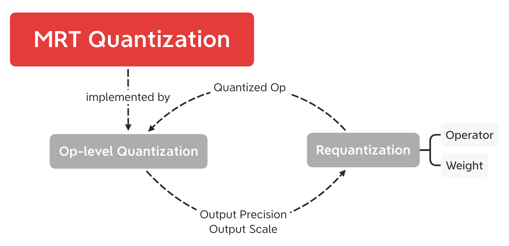

# Quantization Documentation

### Quantization Workflow



### Output Precision and Scale Acquisition

MRT Op-level quantization procedure is  defined  in `quantize` method of `Transformer` defined in [tfm_base.py](https://github.com/CortexFoundation/cvm-runtime/blob/ryt_tune/python/mrt/tfm_base.py), the inheretances of which implement the `quantize` method (defined in [tfm_ops.py](https://github.com/CortexFoundation/cvm-runtime/blob/ryt_tune/python/mrt/tfm_ops.py)), where the `oprec` (output precision) and `oscale` (output scale) (for some cases) is obtained for each operator.

For example, the core python code of the quantization of  `Convolution` is listed as follows.

```python
oprec = kwargs['op_input_precs'][op_name]
X, xprec, xs = requant_operator(childs[0], oprec, oname=name, **kwargs)
W, wprec, ws = requant_parameter(cns[1], oprec, oname=name, **kwargs)
B, bprec = None, None
if not get_attr(attr, 'no_bias', False):
    bs = ws * xs
    bias_prec = get_bit(th_dict[cns[2]] * bs)
    B, bprec, _ = requant_parameter(
        cns[2], bias_prec, bs, oname=name, **kwargs)
scales[name] = ws * xs
op = get_mxnet_op(op_name)(X, W, B, **attr, name=name)

shp = kwargs['params'][childs[1].attr('name')].shape
k = int(nd.prod(nd_array(shp[1:])).asscalar())
kprec = get_bit_cnt(k)
infer_prec = kprec + xprec + wprec
if not get_attr(attr, 'no_bias', False):
    infer_prec = max(infer_prec, bprec) + 1
kwargs['precs'][name][OUT_KEY] = infer_prec
```

### Operator or Weight Quantization

The operator or weight quantization is realized `requant` method defined in [tfm_utils.py](https://github.com/CortexFoundation/cvm-runtime/blob/ryt_tune/python/mrt/tfm_utils.py), where the properly specified `oprec` (and `oscale` if necessary) will be taken as input parameters.  

Weight is directory quantized from floating point values to int values by `int_realize` method.  The core python code of weight quantization is listed as follows.

```python
if th_dict[wname] == 0:
    oprec, oscale = 1, 1
    shp = params[wname].shape
    params[Wn] = sutils.nd_zeros(shp)
    attr = {'precision': '1'}
    W = mx.sym.var(Wn, shape=shp, attr=attr)
else:
    oprec = kwargs['precs'][wname].get(kwargs['oname'], oprec)
    oscale = oscale if oscale else scale(th_dict[wname], oprec)
    params[Wn] = sim.int_realize(
        params[wname].astype("float64") * oscale,
        oprec, logger=logger)
    attr = {'precision': str(oprec)}
    max_v = params[Wn].abs().max().asscalar()
    range_v = (2**(oprec-1)-1)
    assert max_v <= range_v
    W = mx.sym.var(Wn, shape=params[Wn].shape, attr=attr)
```

While for operators, we could take the output of the former layer as the int-realized input data of the current layer to be quantized. this input data is within the precision range of `iprec` stored in the dict `precs`and output scales of the former layer are lazily in the dict `scales`. Therefore, the input should be requantized, which means that the `rescale` (scale-iscale ratio) need to be calculated. The core python code of operator quantization is listed as follows.

```python
if th_dict[xn] == 0:
    return X, 1, oscale if oscale else 1

exactly = True if oscale else False
oprec = precs[xn].get(kwargs['oname'], oprec)
oscale = oscale if oscale else scale(th_dict[xn], oprec)
iscale = kwargs['scales'][xn]
iprec = precs[xn][OUT_KEY]

sb = get_bit(th_dict[xn]*iscale) - oprec
if sb > shift_bits:
    iprec -= sb
    X = realize(X, sb, iprec)
    iscale = iscale / (2**sb)

if exactly or iprec > oprec:
    rescale = oscale / iscale
    bits = MAX_BIT - iprec
    frac, exp = sim.cvm_float(rescale, bits)
    sim_scale = frac * (2 ** exp)
    scale_err = abs((sim_scale - rescale) / rescale)
    if scale_err > 0.001:
        logger.warn(
            "Operator  %-20s name=%-40s quantize with sb=%s" +
            " scale=%s, error=%s",
            xopn, xn, sb, iscale, scale_err)
    oscale = iscale * frac * (2 ** exp)
    if frac > 1:
        var = sutils.nd_const(frac, graph, params)
        X = mx.sym.broadcast_mul(X, var, name=N.n("mrt_quantize_scale"))
    X = realize(X, -exp, oprec)
else:
    oscale = iscale
```

